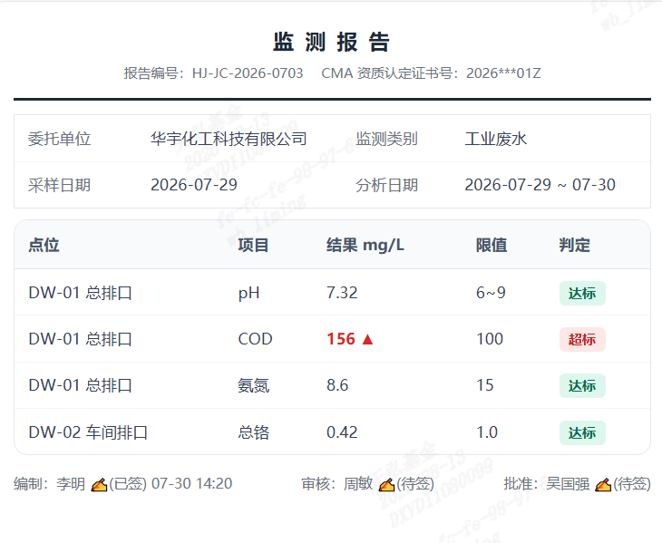

1. 在采样管理列表中，增加一个样品登记按钮，点击打开样品管理中 样品登记 表单界面;

2.检测报告，选择客户后，选择客户相关的委托单，检测任务展示 委托单关联的样品相关的检测任务，选择检测任务
生成以下格式报告

在报告审核页面增加生成报告 按钮，点击按钮打开报告生成创建，输入报告名称，必填，输入CMA 资质认定证书号，必填，选择复核人（人员选择日器）必填，选择批准人（人员选择器）必填，选择检测委托 必填，加载委托单关联样品的检测任务清单，用户勾选或者全选任务，点击生成报告，状态变更为待复核，点击保存草稿 状态变更为 草稿，在全部列表中展示报告清单；
1. 草稿状态下报告，可以执行提交操作，点击提交 状态变更为 待审核
2. 点击报告，可以打开报告页面，页面中支持pdf下载
3. 报告样式如下图